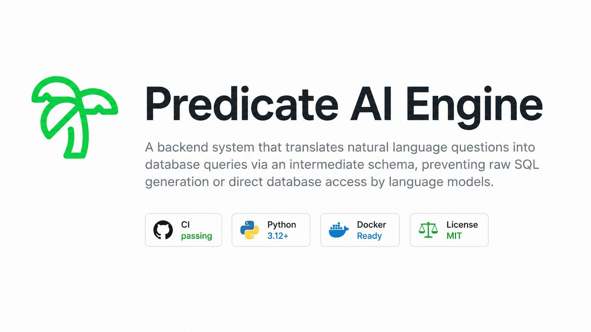
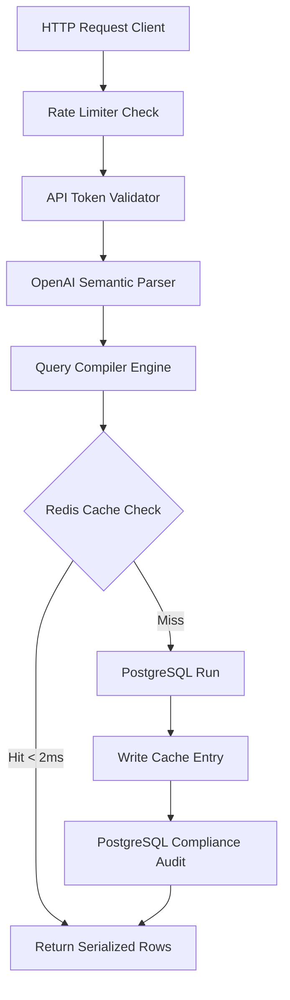
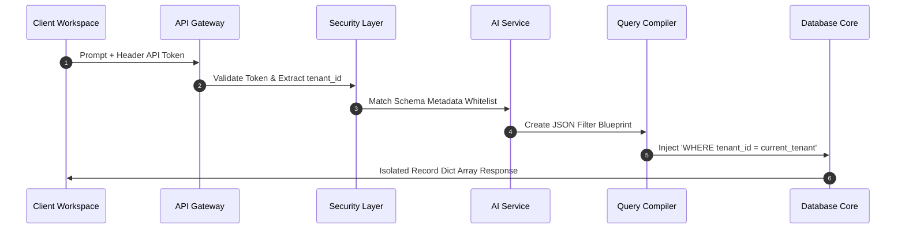

<p align="center">
  
</p>

<p align="center">
  
  
  
  
</p>

<p align="center">
A backend system that translates natural language questions into database queries through an intermediate schema, preventing raw SQL generation and direct database access by language models.
</p>

---

## Architecture

The system separates semantic parsing from database execution, allowing language models to reason only about a controlled schema while the backend remains responsible for query generation, authorization, caching, and auditing.

### Request Execution Path



### Multi-Tenant Isolation Sequence



1. **Authentication & Rate Limiting:** Validates API tokens and enforces request limits using atomic Redis counters.
2. **Semantic Parser:** Converts natural language into a strict Pydantic blueprint using configurable LLM providers (OpenAI, OpenRouter).
3. **Query Compiler:** Produces parameterized SQL while automatically applying joins and tenant filters.
4. **Cache Layer:** Uses SHA-256 query signatures to serve cached results from Redis before querying PostgreSQL.
5. **Audit Pipeline:** Persists prompts, compiled SQL, and parameters for compliance and traceability.
6. **Background Workers:** Processes long-running CSV exports asynchronously through Celery and Redis.

---

## Performance & Benchmarks

The SQL compiler operates with sub-microsecond overhead and no shared-state lock contention. Benchmarks were executed on an Apple M1 (4 Performance + 4 Efficiency cores).

| Workers | Aggregate Throughput | p50 Latency | p99 Latency | Efficiency |
| :------ | -------------------: | ----------: | ----------: | ---------: |
| **1 Process** | 174,000 q/s | 3.6 μs | 4.5 μs | 100% |
| **2 Processes** | 345,000 q/s | 3.6 μs | 4.8 μs | **99.2%** |
| **4 Processes** | **641,000 q/s** | 3.6 μs | 11.0 μs | **92.0%** |
| **8 Processes** | 778,000 q/s | 3.7 μs | 13.4 μs | 55.9% |

Highlights:

- **SHA-256 Signature Overhead:** ~1 μs per query.
- **Near Linear Scaling:** ~99% efficiency across isolated CPU cores.
- **Stable Latency:** p50 remains at approximately 3.6 μs regardless of worker count.
- **Cloud Projection:** Estimated throughput exceeds **2 million queries per second** on modern 32-core cloud instances.

To reproduce:

```bash
./venv/bin/python benchmark.py
```

---

## Getting Started

### Prerequisites

- Python 3.14+
- PostgreSQL 15+ (or Docker)
- Redis 7+ (or Docker)
- LLM API key (OpenRouter free tier or OpenAI)

### Local Setup (no Docker)

```bash
# Install dependencies
python3 -m venv venv
source venv/bin/activate
pip install -r requirements.txt

# Start services (Homebrew)
brew services start postgresql
brew services start redis

# Create database and seed
createdb predicate_db
psql predicate_db < init.sql

# Configure environment
cp .env.example .env
# Edit .env with your LLM API key

# Run
uvicorn app.main:app --reload
```

### Docker Setup

```bash
cp .env.example .env

# Configure your LLM API key (OpenRouter free or OpenAI).
# Enable REQUIRE_AUTH=true when testing authenticated deployments.

docker-compose up --build
```

After startup:

- Workspace: `http://localhost:8000`
- Swagger UI: `http://localhost:8000/docs`
- Health Check: `http://localhost:8000/health`

---

## API

### Compile & Execute Query

**POST** `/api/v1/query/compile`

Header

```text
X-Predicate-API-Key: <your_key>
```

Request

```json
{
  "prompt": "Show me order ids and customer names for active customers in Germany"
}
```

Response

Returns:

- Parameterized SQL
- Query parameters
- Result rows
- `cache_hit` status

---

### Tenant Metrics

**GET** `/api/v1/metrics`

Returns:

- Total requests
- Cache hits
- Database misses
- Requests per minute

---

### Asynchronous CSV Export

**POST** `/api/v1/export/async`

Returns:

- `task_id`
- `poll_url`

Status endpoint:

```text
GET /api/v1/export/status/{task_id}
```

Possible states:

- `PROCESSING`
- `SUCCESS`
- `FAILURE`

---

## Database Migrations

Alembic manages schema versioning. Migrations live in `alembic/versions/`.

### Commands

```bash
# Apply all pending migrations
alembic upgrade head

# Roll back one revision
alembic downgrade -1

# Generate a new migration (requires manual SQL in offline mode)
alembic revision --autogenerate -m "description"

# View current revision
alembic current

# History of migrations
alembic history
```

### Migration Files

- `001_initial` - Creates customers, orders, products, audit_logs tables
- `002_seed` - Inserts sample data

### Important Notes

Since Predicate uses psycopg2 directly (not SQLAlchemy ORM), migrations must be written manually. The `autogenerate` command will create a stub that you fill with SQL operations.

---

## Reusing the Engine

To support another database schema, update only:

```
app/compiler/sql_builder.py
```

Modify:

- `ALLOWED_SCHEMA`
- `RELATIONSHIP_GRAPH`

The remaining pipeline, including authentication, caching, routing, auditing, metrics, and background workers, adapts automatically.

---

## Testing

Run the complete test suite:

```bash
source venv/bin/activate
pytest -v
```

---

## Project Structure

```text
predicate/
├── .github/
│   └── workflows/
│       └── ci.yml
├── alembic/
│   ├── versions/
│   │   ├── 2026_07_26_0000-001_initial_initial_schema.py
│   │   └── 2026_07_26_0001-002_seed_seed_initial_data.py
│   ├── env.py
│   └── script.py.mako
├── app/
│   ├── agent/
│   ├── auth/
│   ├── compiler/
│   ├── database/
│   ├── static/
│   ├── main.py
│   └── worker.py
├── deploy/
├── docs/
├── tests/
├── alembic.ini
├── benchmark.py
├── docker-compose.yml
├── docker-compose.prod.yml
├── Dockerfile
├── init.sql
├── LICENSE
├── README.md
├── requirements.txt
└── pytest.ini
```
