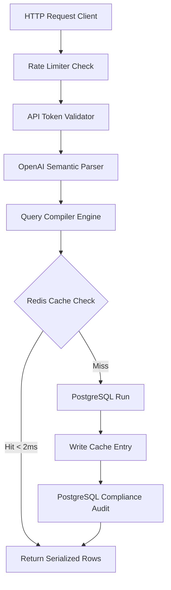
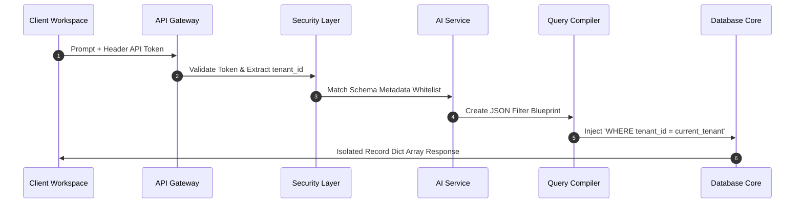

# Predicate AI Engine

A backend system that translates natural language questions into database queries via an intermediate schema, preventing raw SQL generation or direct database access by language models.

## Architecture

The system isolates semantic parsing from the database execution layer:

### Request Execution Path



### Multi-Tenant Isolation Sequence



1. **Authentication & Rate Limiting:** Enforces token validation and checks requests per minute using an atomic Redis counter.
2. **Semantic Parser:** Utilizes OpenAI Structured Outputs to map inputs into a strict Pydantic JSON blueprint.
3. **Query Compiler:** Translates the JSON blueprint into parameterized SQL, automatically appending table relationships (JOINs) and tenant filters.
4. **Data Cache:** Validates query signatures (SHA-256) against Redis. Hits return in <2ms. Misses fall back to PostgreSQL and update the cache.
5. **Audit Sink:** Logs the prompt, compiled SQL, and parameters permanently to PostgreSQL for compliance tracking.
6. **Background Tasks:** Offloads bulk CSV exports to Celery workers via Redis to prevent HTTP timeouts.

---

## Getting Started

### Prerequisites
* Docker and Docker Compose
* OpenAI API Key

### Local Deployment

Configure environment variables and start the container network:

```bash
cp .env.example .env
# Set your OPENAI_API_KEY and set REQUIRE_AUTH=true if testing security restrictions
docker-compose up --build
```

Endpoints available post-boot:
* API Docs (Swagger UI): `http://localhost:8000/docs`
* Health Endpoint: `http://localhost:8000/health`

---

## API Documentation

### 1. Compile and Execute Query
* **Method & Route:** `POST /api/v1/query/compile`
* **Header:** `X-Predicate-API-Key: <your_key>`
* **Request Body:**
```json
{
  "prompt": "Show me order ids and customer names for active customers in Germany"
}
```
* **Response Body:** Returns compiled SQL with placeholders, parameter values, database result rows, and a `cache_hit` boolean flag.

### 2. Live Tenant Metrics
* **Method & Route:** `GET /api/v1/metrics`
* **Response Body:** Returns real-time metrics for the authenticated tenant, including total requests, cache hits, database misses, and current requests per minute.

### 3. Asynchronous Bulk CSV Export
* **Method & Route:** `POST /api/v1/export/async`
* **Response Body:** Returns a `task_id` and a `poll_url` instantly.
* **Status Checks:** Querying `GET /api/v1/export/status/{task_id}` returns the job state (`PROCESSING`, `SUCCESS`, or `FAILURE`) along with the final CSV data upon completion.

---

## Domain Reusability

To adapt this codebase to a different database schema, modify only `app/compiler/sql_builder.py`:

1. Update **`ALLOWED_SCHEMA`** with your target tables and permitted columns to reset the validation whitelist.
2. Update **`RELATIONSHIP_GRAPH`** with your foreign key definitions to enable automatic relational inner joins.

The rest of the pipeline (caching, authentication, routing, background workers) will automatically conform to the new definitions.

---

## Testing

Run the automated test suite locally to verify the compiler logic, security constraints, and tenancy boundaries:

```bash
source venv/bin/activate
pytest -v
```

---

## Project Structure

```
predicate/
├── .github/workflows/ci.yml
├── app/
│   ├── main.py
│   ├── worker.py
│   ├── agent/
│   │   ├── prompts.py
│   │   └── services.py
│   ├── auth/
│   │   ├── rate_limiter.py
│   │   └── security.py
│   ├── compiler/
│   │   └── sql_builder.py
│   ├── database/
│   │   ├── audit.py
│   │   ├── cache.py
│   │   ├── connection.py
│   │   └── metrics.py
│   └── static/
│       └── index.html
├── deploy/nginx/predicate.conf
├── docs/
│   ├── deploy.sh
│   └── enterprise-deployment-blueprint.md
├── tests/
│   ├── test_aggregations.py
│   ├── test_api.py
│   ├── test_compiler.py
│   ├── test_integration.py
│   └── test_security.py
├── .env.example
├── .env.production
├── .gitignore
├── Dockerfile
├── LICENSE
├── README.md
├── docker-compose.yml
├── docker-compose.prod.yml
├── init.sql
├── pytest.ini
└── requirements.txt
```