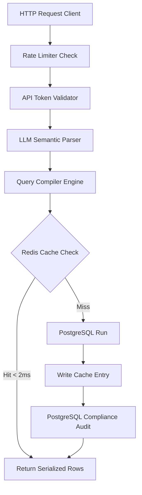
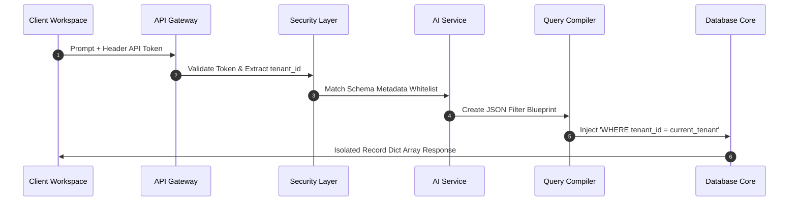

<p align="center">
  
</p>

<p align="center">
  
  
  
  
</p>

<p align="center">
Secure natural language to SQL compilation with a built-in workspace.
</p>

---

## How It Works

```
User Text → AI Agent (Pydantic) → JSON Blueprint → SQL Compiler → Cache/DB → Results
```

The LLM never touches raw SQL. It produces a structured JSON blueprint containing `target_table`, `projection_columns`, `filters`, `sorting`, `pagination`, and `aggregation`. The SQL compiler converts these blueprints to parameterized queries with `%s` placeholders. `tenant_id` is injected server-side from validated API keys -- never from user input. `ALLOWED_SCHEMA`, `RELATIONSHIP_GRAPH`, and `ALLOWED_AGGREGATIONS` in `sql_builder.py` whitelist all tables, columns, JOINs, and aggregations.

### Request Execution Path



### Multi-Tenant Isolation Sequence



---

## Features

### Frontend Workspace

React IDE-style UI with a command palette (Ctrl+K / Cmd+K), query history persisted in localStorage, a keyboard-navigable schema explorer tree, and a virtual results table with sort, filter, column resize, and inline edit. Keyboard shortcuts for copy SQL (C), export CSV (E), cycle theme (T), and shortcuts help (?).

### Security

Secure headers (X-Frame-Options DENY, nosniff, HSTS, CSP, Referrer-Policy, Permissions-Policy), CSRF protection via signed cookie + header match, input validation (MAX_PROMPT_LENGTH), query timeouts, and a read-only database role (`predicate_reader`).

### Observability

Structured JSON logging, X-Request-ID correlation, TraceContext spans across compile, validate, cache, and execute stages, Prometheus metrics at `/metrics`, per-provider metrics, and health (`/health`) and readiness (`/ready`) endpoints.

### Multi-Tenant

3-tier rate limiting (sandbox 60, growth 20, enterprise 100 RPM), isolated `tenant_id` per API key, and audit logs with `request_id`, timing, `target_table`, and `error_code`.

### Async Export

Celery workers for long-running CSV exports with progress states.

---

## Getting Started

### Prerequisites

- Python 3.14+
- PostgreSQL 15+ (or Docker)
- Redis 7+ (or Docker)
- LLM API key (OpenRouter free tier or OpenAI)

### Quick Start (Docker)

```bash
cp .env.example .env
# Edit .env -- set your LLM API key
docker-compose up --build
```

- Workspace: `http://localhost:8000`
- Swagger UI: `http://localhost:8000/docs`
- Health Check: `http://localhost:8000/health`

### Local Setup

```bash
python3 -m venv venv
source .venv/bin/activate
pip install -r requirements.txt

brew services start postgresql
brew services start redis

createdb predicate_db
psql predicate_db < init.sql

cp .env.example .env
# Edit .env

uvicorn app.main:app --reload
```

---

## Configuration

| Variable | Description | Default |
| :--- | :--- | :--- |
| `LLM_PROVIDER` | LLM backend (`openai` or `openrouter`) | `openrouter` |
| `LLM_MODEL` | Model identifier | `nvidia/nemotron-3-super-120b-a12b:free` |
| `REQUIRE_AUTH` | Enable API key authentication | `false` |
| `DATABASE_URL` | Primary PostgreSQL connection string | -- |
| `DATABASE_READONLY_URL` | Read-only PostgreSQL connection string | -- |
| `REDIS_URL` | Redis connection string | -- |
| `MAX_PROMPT_LENGTH` | Maximum characters per prompt | `2000` |
| `QUERY_TIMEOUT_SECONDS` | Per-query execution timeout | `30` |
| `CSRF_SECRET_KEY` | Secret for CSRF cookie signing | -- |
| `ALLOWED_ORIGINS` | Comma-separated CORS origins | -- |
| `LOG_LEVEL` | Logging level | `INFO` |
| `LOG_FORMAT` | Log output format (`json` or `text`) | `json` |

---

## API

### Compile and Execute Query

**POST** `/api/v1/query/compile`

Header:

```text
X-Predicate-API-Key: <your_key>
```

Request:

```json
{
  "prompt": "Show me order ids and customer names for active customers in Germany"
}
```

Response:

```json
{
  "status": "success",
  "request_id": "6e25441a-d376-4322-8d36-f29e3033fa23",
  "compiled_sql": "SELECT customers.* FROM customers WHERE customers.tenant_id = %s AND customers.country = %s LIMIT 20 OFFSET 0;",
  "parameters": ["tenant_alpha", "Germany"],
  "cache_hit": false,
  "results": [
    {"id": 1, "name": "Hans Mueller", "country": "Germany", "status": "active"},
    {"id": 2, "name": "Anna Schmidt", "country": "Germany", "status": "active"}
  ],
  "agent_blueprint": {
    "target_table": "customers",
    "projection_columns": [],
    "filters": [
      {"column": "country", "operator": "equals", "value": "Germany"}
    ],
    "sorting": null,
    "pagination": {"limit": 20, "offset": 0}
  },
  "trace": {
    "request_id": "6e25441a-d376-4322-8d36-f29e3033fa23",
    "tenant_id": "tenant_alpha",
    "total_ms": 3503.63,
    "spans": [
      {"name": "compile", "ms": 3490.18},
      {"name": "validate", "ms": 0.04},
      {"name": "cache_lookup", "ms": 0.74},
      {"name": "execute", "ms": 10.33}
    ]
  }
}
```

### Tenant Metrics

**GET** `/api/v1/metrics`

Returns total requests, cache hits, database misses, and requests per minute for the authenticated tenant.

### Async CSV Export

**POST** `/api/v1/export/async`

Returns a `task_id` and `poll_url` for tracking progress.

### Export Status

**GET** `/api/v1/export/status/{task_id}`

Returns the current state: `PROCESSING`, `SUCCESS`, or `FAILURE`.

### Health Check

**GET** `/health`

Returns `version`, `git_commit`, `build_date`, `uptime`, `memory`, `pid`, and `llm_provider`.

### Readiness Probe

**GET** `/ready`

Returns 200 when all dependencies are reachable.

### Prometheus Metrics

**GET** `/metrics`

Returns metrics in Prometheus exposition format.

---

## Keyboard Shortcuts

| Shortcut | Action |
| :--- | :--- |
| Ctrl+K / Cmd+K | Command palette |
| Ctrl+Enter / Cmd+Enter | Run query |
| Ctrl+L / Cmd+L | Focus input |
| C | Copy SQL (when results visible) |
| E | Export CSV (when results visible) |
| T | Cycle theme (Light, Dim, Dark) |
| ? | Show shortcuts |
| Escape | Close palette / modal |

---

## Security

Predicate prevents classic SQL injection by design through a compiler-based architecture. The LLM is treated as an untrusted parser -- it produces a validated JSON blueprint, not SQL. The compiler generates SQL only from a schema whitelist and always uses parameterized queries.

- All SQL is parameterized -- the AI never touches raw SQL.
- `tenant_id` is injected server-side and cannot be forged from client input.
- Query execution runs under a read-only database role (`predicate_reader`).
- CSRF, CSP, HSTS, and secure headers are applied on every response.
- Input validation is enforced on all endpoints.
- Query timeouts prevent runaway queries from exhausting resources.
- Rate limiting is enforced per tenant.
- See `docs/threat-model.md` for the full threat analysis.

---

## Architecture

```
predicate/
├── app/
│   ├── agent/          # LLM integration, prompt templates, QueryBlueprint
│   ├── auth/           # API key validation, rate limiting
│   ├── compiler/       # SQL builder with schema whitelist
│   ├── database/       # Connection pools, cache, metrics, audit
│   ├── middleware/      # Security headers, CSRF, request ID
│   ├── observability/  # Logging, tracing, metrics
│   ├── static/         # Frontend workspace (React)
│   ├── main.py         # FastAPI application
│   └── worker.py       # Celery background tasks
├── alembic/            # Database migrations
├── deploy/nginx/       # Nginx configuration
├── docs/               # Documentation
├── tests/              # 37 tests
├── benchmark.py        # Performance benchmark suite
└── init.sql            # Database schema
```

---

## Benchmarks

The SQL compiler operates with sub-microsecond overhead and no shared-state lock contention. Benchmarks were executed on an Apple M1 (4 Performance + 4 Efficiency cores).

| Workers | Aggregate Throughput | p50 Latency | p99 Latency | Efficiency |
| :--- | ---: | ---: | ---: | ---: |
| **1 Process** | 174,000 q/s | 3.6 us | 4.5 us | 100% |
| **2 Processes** | 345,000 q/s | 3.6 us | 4.8 us | 99.2% |
| **4 Processes** | 641,000 q/s | 3.6 us | 11.0 us | 92.0% |
| **8 Processes** | 778,000 q/s | 3.7 us | 13.4 us | 55.9% |

Pipeline load test: 82 req/s single-thread, 802 req/s 10-thread, p50=10us.

Compiler throughput remains sub-microsecond at all schema scales from 10 to 500 tables. Failure injection: 13/13 tests pass.

To reproduce:

```bash
python3 benchmark.py                    # all phases
python3 benchmark.py --phase 1          # compiler only
python3 benchmark.py --phase 3 --users 100 --duration 30
```

See `docs/benchmark-methodology.md` for details.

---

## Testing

```bash
source .venv/bin/activate
pytest -v
```

37 tests across 5 files: compiler, API, security, aggregations, and integration.

---

## Database Migrations

Alembic manages schema versioning. Migrations live in `alembic/versions/`.

### Commands

```bash
# Apply all pending migrations
alembic upgrade head

# Roll back one revision
alembic downgrade -1

# Generate a new migration (requires manual SQL in offline mode)
alembic revision --autogenerate -m "description"

# View current revision
alembic current

# History of migrations
alembic history
```

### Migration Files

- `001_initial` -- Creates customers, orders, products, audit_logs tables
- `002_seed` -- Inserts sample data

### Important Notes

Since Predicate uses psycopg2 directly (not SQLAlchemy ORM), migrations must be written manually. The `autogenerate` command will create a stub that you fill with SQL operations.

---

## Reusing the Engine

To support another database schema, update only:

```
app/compiler/sql_builder.py
```

Modify:

- `ALLOWED_SCHEMA`
- `RELATIONSHIP_GRAPH`

The remaining pipeline, including authentication, caching, routing, auditing, metrics, and background workers, adapts automatically.

---

## Hero Image

The README hero is code-generated SVG. To update badges or text:

```bash
# Edit hero/badges.js, then:
node hero/build.js
```

Badge definitions live in `hero/badges.js`. The build script outputs `.github/website/hero.svg`.

---

## License

MIT License. See [LICENSE](LICENSE) for details.
